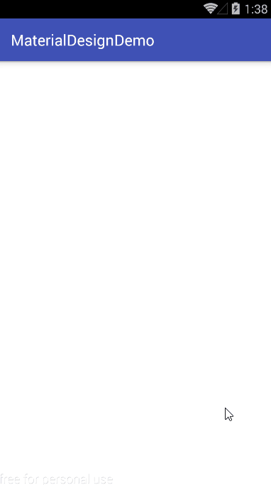
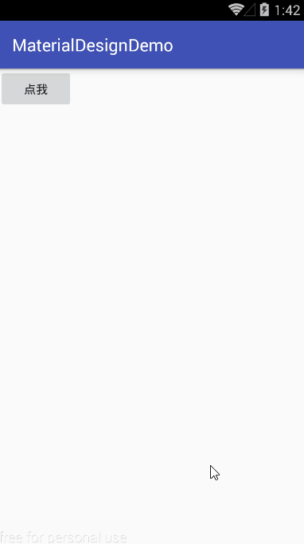
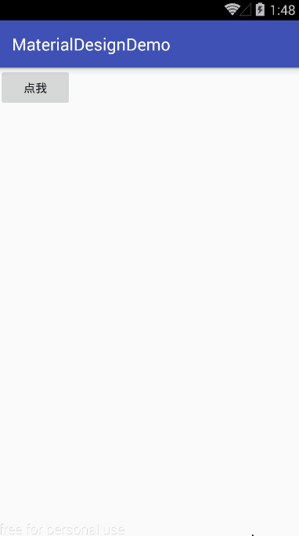
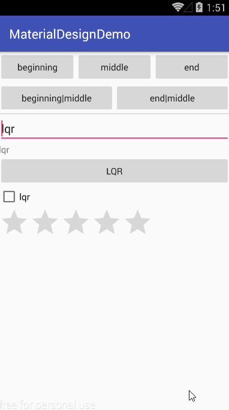

# 简述

Material Design从Android 5.0开始引入，是一种全新的设计语言，称为“原材料设计”，是谷歌提倡的一种设计风格、理念、原则。结合拟物设计和扁平化设计风格，融入了一些科技理念。

想深入了解的话，可以查这篇wiki：[Material Design 中文版](http://wiki.jikexueyuan.com/project/material-design/material-design-intro/introduction.html)

**注：使用下文中介绍的控件，需在项目中引入v7包的支持。正如上面所说，Material Design从Android 5.0开始引入，故低版本的系统没有这类控件。*

如：使用Android Studio可以在gradle的dependencies中写入：

	compile 'com.android.support:appcompat-v7:25.3.0'

Eclipse的请自行百度吧，毕竟就算导入了v7包，若编译版本和v7包的版本存在新旧问题时，v7包工程自身会报错的，还有其他一些细节要注意，这里就不做介绍了。

# 一、SwipeRefreshLayout

## 1、使用

SwipeRefreshLayout是谷歌推出的一个下拉刷新控件，符合MD设计，使用方便，可通过其提供的方法设置控件的尺寸、颜色、刷新距顶悬浮距离等，具体使用如下：

    //设置 SwipeRefreshLayout 的尺寸
    mSrl.setSize(SwipeRefreshLayout.LARGE);
    //设置 SwipeRefreshLayout 刷新时的颜色切换（可以有无数种）
    mSrl.setColorSchemeColors(Color.RED, Color.YELLOW, Color.GREEN);
    //设置 SwipeRefreshLayout 的背景色
    mSrl.setBackgroundColor(Color.GRAY);
    //设置 SwipeRefreshLayout 的下拉距离
    mSrl.setDistanceToTriggerSync(100);
    //设置 SwipeRefreshLayout 正在刷新监听
    mSrl.setOnRefreshListener(new SwipeRefreshLayout.OnRefreshListener() {
        @Override
        public void onRefresh() {
            ...
			刷新数据源
			...
        }
    });
	//手动停止刷新
	mSrl.setRefreshing(false);

## 2、效果预览：

# 二、ListPopupWindow
popupWindow大家都知道，是Android中弹出式菜单，而ListPopupWindow顾名思义就是列表型的弹出式菜单，使用该控件可以做到类似下拉菜单的功能，但不限如此。

## 1、使用

    mListPopupWindow = new ListPopupWindow(this);
    //设置 ListPopupWindow 的数据适配器
    mListPopupWindow.setAdapter(mAdapter);
    //设置 ListPopupWindow 的显示位置（在指定控件下方）
    mListPopupWindow.setAnchorView(view);
    //设置 ListPopupWindow 的宽度
    mListPopupWindow.setWidth(200);
    //设置 ListPopupWindow 的高度
    mListPopupWindow.setHeight(500);
    //设置 ListPopupWindow 的条目点击事件（必须在show方法前设置，否则无效）
    mListPopupWindow.setOnItemClickListener(new AdapterView.OnItemClickListener() {
        @Override
        public void onItemClick(AdapterView<?> parent, View view, int position, long id) {
            Toast.makeText(getApplicationContext(), mItemArr[position], Toast.LENGTH_SHORT).show();
            mListPopupWindow.dismiss();
        }
    });
    mListPopupWindow.show();

## 2、效果预览：

# 三、PopupMenu

PopupMenu代表弹出式菜单,它会在指定组件上弹出PopupMenu,默认情况下,PopupMenu会显示在该组件的下方或上方。与ListPopupWindow的区别在于，ListPopupWindow使用适配器来填充条目，而PopupMenu则是使用menu布局来填充条目。

## 1、使用

	PopupMenu popupMenu = new PopupMenu(this, view);
	//设置 PopupMenu 的显示菜单项
	popupMenu.inflate(R.menu.main);
	// popupMenu.getMenuInflater().inflate(R.menu.main, popupMenu.getMenu());//与一行没什么区别

	//默认 PopupMenu 不显示条目icon，可以通过反射来强制使其显示icon
	Field field = popupMenu.getClass().getDeclaredField("mPopup");
	field.setAccessible(true);
	MenuPopupHelper mHelper = (MenuPopupHelper) field.get(popupMenu);
	mHelper.setForceShowIcon(true);

	//设置 PopupMenu 的条目点击事件（点击后会自动dismiss）
	popupMenu.setOnMenuItemClickListener(new PopupMenu.OnMenuItemClickListener() {
	    @Override
	    public boolean onMenuItemClick(MenuItem item) {
	        Toast.makeText(getApplicationContext(), item.getTitle(), Toast.LENGTH_SHORT).show();
	        return false;
	    }
	});
	//显示 PopupMenu
	popupMenu.show();

## 2、效果预览：

# 四、LinearLayoutCompat

LinearLayoutCompat是对LinearLayout的扩展，可以为此布局中的子View之间添加分割线divider。可以通过自定义属性divider来指定分割线的样式，通过自定义属性showDividers来指定分割线的显示位置。

## 1、使用

	<android.support.v7.widget.LinearLayoutCompat
        android:id="@+id/llc"
        android:layout_width="match_parent"
        android:layout_height="match_parent"
        android:layout_gravity="center"
        android:orientation="vertical"
        app:divider="@drawable/line"
        app:showDividers="beginning">
			...
			子控件
			...
    </android.support.v7.widget.LinearLayoutCompat>

## 2、效果预览：

# 五、RecyclerView

RecyclerView是v7包中最重要、最常用的控件之一，可实现线性列表、网格列表、瀑布流列表效果，却具有高度解耦、性能优化的优势，可以说是ListView、GridView的增强版。

## 1、使用
RecyclerViewr的使用大体分两步：

- 设置适配器Adapter
- 设置布局管理器LayoutManager

### 1）设置适配器Adapter
RecyclerView使用的适配器必须继承RecyclerView.Adapter，并指定RecyclerView.ViewHolder，在onCreateViewHolder()中创建自定义的RecyclerView.ViewHolder，在onBindViewHolder()中对条目进行设置，理解上相对简单，代码如下：

	public class MyAdapter extends RecyclerView.Adapter<MyAdapter.MyViewHolder> {
	
	    private List<String> mData;
	
	    public MyAdapter(List<String> data) {
	        mData = data;
	    }
	
	    @Override
	    public MyViewHolder onCreateViewHolder(ViewGroup parent, int viewType) {
	        View itemView = View.inflate(parent.getContext(), android.R.layout.simple_list_item_1, null);
	        return new MyViewHolder(itemView);
	    }
	
	    @Override
	    public void onBindViewHolder(MyViewHolder holder, int position) {
	        holder.mTv.setText(mData.get(position));
	    }
	
	    @Override
	    public int getItemCount() {
	        return mData.size();
	    }
	
	    class MyViewHolder extends RecyclerView.ViewHolder {
	
	        TextView mTv;
	
	        public MyViewHolder(View itemView) {
	            super(itemView);
	            mTv = (TextView) itemView.findViewById(android.R.id.text1);
	        }
	    }
	
	}

### 2）设置布局管理器LayoutManager

RecyclerView可以使用布局管理器有三种：

- LinearLayoutManager：线性列表
- GridLayoutManager：网格列表
- StaggeredGridLayoutManager：瀑布流列表

以LinearLayoutManager为例：

	LinearLayoutManager(Context context, int orientation, boolean reverseLayout)

在创建LinearLayoutManage时，可以通过参数二指定列表的方向，通过参数三指定数据是否反转（本来数据是从上到下进行填充，当设置了reverseLayout为true时，数据则从下到上进行填充），GridLayoutManager及StaggeredGridLayoutManager的使用也差不多。

调用RecyclerView的setLayoutManager()即可设置布局管理器

	mRv.setLayoutManager(new LinearLayoutManager(this));

## 2、效果预览：

# 最后附上Demo链接

[https://github.com/GitLqr/MaterialDesignDemo](https://github.com/GitLqr/MaterialDesignDemo)
